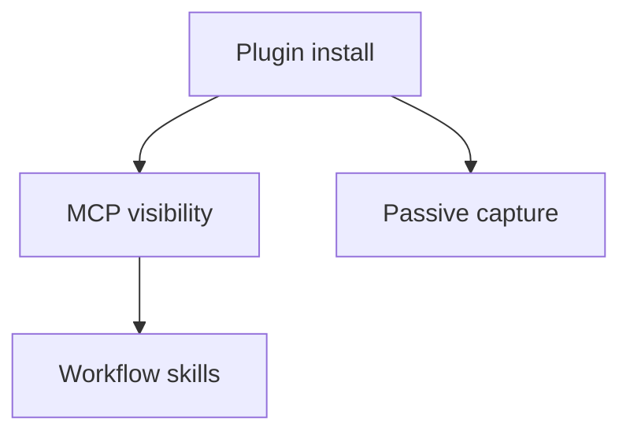

# Titan Cluster Graph Workflow

Titan clusters are a map of related memories. Use them to orient the user, then expand scenes and verify current repo facts before making claims.

## Routing

Use this skill when the user asks for a knowledge graph, cluster map, theme map, project archaeology, recurring topic synthesis, bridges between areas, central memories, or contradictions/tensions across prior work.

## Workflow

1. Call `inspect_clusters` with `limit=0` for a full-corpus view unless the user asks for a smaller window or session-specific view.
2. Identify the most relevant cluster IDs from topics, keywords, representative memories, and counts.
3. Call `analyze_clusters` with a comma-separated `cluster_ids` string for deeper synthesis.
4. Use `get_scene_context` for representative or surprising scene IDs before relying on them.
5. Verify implementation claims against files, tests, or git history when the user needs current truth.

## Output Formats

For a quick answer, summarize clusters as topic, evidence, and why it matters.

For a graph answer, render a small Mermaid graph or ASCII map. Keep it bounded: show the most important 3-7 clusters or bridges instead of dumping every memory.

Example Mermaid shape:

## Safety Rules

Treat tensions as signals, not final contradictions. Do not infer intent or personality from memory clusters. If a cluster is sparse, say the evidence is weak.
